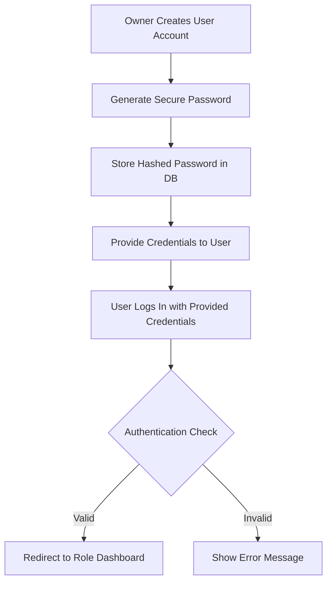
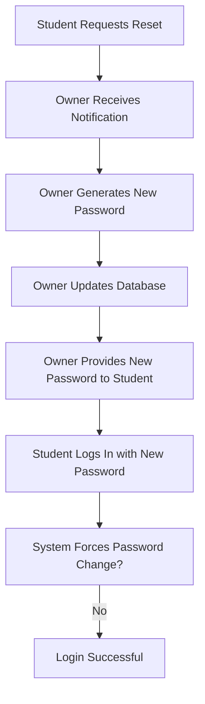

# Authentication System Design

## Overview
A secure, role-based authentication system with manual credential assignment by the owner. No self-registration - all accounts are created and managed by the owner (Raheem).

## Core Principles
1. **No self-registration**: Students cannot create accounts
2. **Manual credential distribution**: Owner creates and distributes credentials
3. **Role-based access control**: Three distinct roles (Owner, Admin, Student)
4. **Centralized login**: Single login page with automatic role detection
5. **No password reset by users**: Only owner can reset passwords

## User Credentials Management

### Credential Creation Process


### Credential Format
- **Username**: Pattern-based (e.g., `student01`, `student02`, `admin1`, `raheem`)
- **Password**: Randomly generated 12-character alphanumeric with symbols
- **Distribution Method**: Secure channel (email, WhatsApp, in-person)

### Sample Credentials Table
| Role | Username | Password (Example) | Full Name |
|------|----------|-------------------|-----------|
| Owner | raheem | R@h33m#2023! | Raheem Ahmed |
| Admin | admin1 | @dm1nP@ss!2023 | Admin One |
| Admin | admin2 | S3cur3@dm1n! | Admin Two |
| Student | student01 | Stu@2023!pass1 | Ali Khan |
| Student | student02 | P@ssw0rd#2023 | Sara Ahmed |
| Student | student03 | 2023$Secure!stu | Ahmed Raza |

## Authentication Flow

### Login Process
```javascript
// Pseudocode for login process
function login(username, password) {
    // 1. Validate input
    if (!username || !password) return error("Missing credentials");
    
    // 2. Check against simulated database
    const user = users.find(u => u.username === username);
    if (!user) return error("Invalid username or password");
    
    // 3. Verify password (simulated bcrypt)
    if (!verifyPassword(password, user.password_hash)) {
        logFailedAttempt(username);
        return error("Invalid username or password");
    }
    
    // 4. Check if account is active
    if (!user.is_active) return error("Account deactivated");
    
    // 5. Create session
    const sessionToken = createSession(user);
    
    // 6. Update last login
    updateLastLogin(user.id);
    
    // 7. Log activity
    logActivity(user.id, 'login', 'User logged in successfully');
    
    // 8. Redirect based on role
    switch(user.role) {
        case 'owner':
            redirect('/owner/dashboard.html');
            break;
        case 'admin':
            redirect('/admin/dashboard.html');
            break;
        case 'student':
            redirect('/student/dashboard.html');
            break;
    }
}
```

### Session Management
```javascript
// Session storage structure
const sessions = {
    'session_token_123': {
        userId: 1,
        username: 'raheem',
        role: 'owner',
        createdAt: '2023-10-10T10:00:00Z',
        expiresAt: '2023-10-11T10:00:00Z', // 24 hours
        ipAddress: '192.168.1.1',
        userAgent: 'Chrome/118.0.0.0'
    }
};

// Middleware to check authentication
function requireAuth(requiredRole = null) {
    return function(req, res, next) {
        const sessionToken = req.cookies.session_token;
        
        if (!sessionToken || !sessions[sessionToken]) {
            redirect('/login.html');
            return;
        }
        
        const session = sessions[sessionToken];
        
        // Check if session expired
        if (new Date() > new Date(session.expiresAt)) {
            delete sessions[sessionToken];
            redirect('/login.html');
            return;
        }
        
        // Check role if required
        if (requiredRole && session.role !== requiredRole) {
            return error('Insufficient permissions');
        }
        
        // Attach user to request
        req.user = {
            id: session.userId,
            username: session.username,
            role: session.role
        };
        
        next();
    };
}
```

## Password Security

### Hashing Algorithm
- **Algorithm**: bcrypt with cost factor 12
- **Salt**: Automatically generated by bcrypt
- **Storage**: `password_hash` field in users table

```javascript
// Password hashing example
const bcrypt = require('bcrypt');
const saltRounds = 12;

// Hash password
async function hashPassword(password) {
    return await bcrypt.hash(password, saltRounds);
}

// Verify password
async function verifyPassword(password, hash) {
    return await bcrypt.compare(password, hash);
}
```

### Password Policy
- Minimum length: 12 characters
- Must include: uppercase, lowercase, numbers, symbols
- No common passwords (check against common password list)
- No password reuse (track password history)
- Automatic expiration: 90 days (owner can reset)

## Login Page Design

### UI Components
1. **Brand Header**: Logo and platform name
2. **Login Form**:
   - Username field (with auto-complete hint)
   - Password field (with show/hide toggle)
   - Remember me checkbox (for 7 days)
   - Submit button
3. **Help Section**:
   - "Forgot password?" link (contacts owner)
   - "Need an account?" (explains manual creation)
4. **Status Messages**:
   - Success/error notifications
   - Account status warnings

### Error Handling
```javascript
const errorMessages = {
    'invalid_credentials': 'Invalid username or password. Please try again.',
    'account_inactive': 'Your account has been deactivated. Contact the owner.',
    'session_expired': 'Your session has expired. Please log in again.',
    'too_many_attempts': 'Too many failed attempts. Try again in 15 minutes.',
    'maintenance_mode': 'System is under maintenance. Please try again later.'
};
```

### Security Features
1. **Rate Limiting**: Max 5 attempts per 15 minutes
2. **CAPTCHA**: After 3 failed attempts
3. **IP Tracking**: Log IP addresses for security monitoring
4. **Browser Fingerprinting**: Detect suspicious login patterns
5. **Session Fixation Prevention**: Regenerate session ID on login

## Role-Based Access Control (RBAC)

### Permission Matrix
| Endpoint | Owner | Admin | Student | Public |
|----------|-------|-------|---------|--------|
| `/` (Home) | ✓ | ✓ | ✓ | ✓ |
| `/login` | ✓ | ✓ | ✓ | ✓ |
| `/about` | ✓ | ✓ | ✓ | ✓ |
| `/student/dashboard` | ✓ | ✓ | ✓ | ✗ |
| `/student/upload` | ✓ | ✓ | ✓ | ✗ |
| `/admin/dashboard` | ✓ | ✓ | ✗ | ✗ |
| `/admin/approvals` | ✓ | ✓ | ✗ | ✗ |
| `/owner/dashboard` | ✓ | ✗ | ✗ | ✗ |
| `/owner/users` | ✓ | ✗ | ✗ | ✗ |

### Route Protection Middleware
```javascript
// Route protection examples
app.get('/student/dashboard', requireAuth('student'), studentDashboard);
app.get('/admin/dashboard', requireAuth('admin'), adminDashboard);
app.get('/owner/dashboard', requireAuth('owner'), ownerDashboard);

// Multi-role access
app.get('/reports', requireAnyRole(['owner', 'admin']), reportsPage);

// Owner-only with override
app.post('/users/reset-password', requireAuth('owner'), resetPassword);
```

## Account Management

### Owner Functions
1. **Create User**:
   - Generate username (sequential or custom)
   - Generate secure password
   - Assign role and permissions
   - Set initial profile information

2. **Edit User**:
   - Change personal details
   - Reset password (generates new one)
   - Change role (promote/demote)
   - Activate/deactivate account

3. **Delete User**:
   - Soft delete (mark as inactive)
   - Option to purge data after 30 days
   - Transfer ownership of notes if needed

### Admin Functions (Limited)
1. **View Student List**: Read-only access
2. **Deactivate Student**: Temporary suspension
3. **View Activity Logs**: Student activities only

### Student Functions
1. **View Profile**: Read-only personal information
2. **Request Password Reset**: Sends notification to owner
3. **Update Profile Picture**: Upload new avatar

## Security Measures

### 1. Brute Force Protection
```javascript
const failedAttempts = new Map();

function checkBruteForce(username, ip) {
    const key = `${username}:${ip}`;
    const attempts = failedAttempts.get(key) || [];
    
    // Remove attempts older than 15 minutes
    const recentAttempts = attempts.filter(
        time => Date.now() - time < 15 * 60 * 1000
    );
    
    if (recentAttempts.length >= 5) {
        return false; // Block login
    }
    
    recentAttempts.push(Date.now());
    failedAttempts.set(key, recentAttempts);
    return true;
}
```

### 2. Session Security
- HTTP-only cookies
- Secure flag (HTTPS only)
- SameSite strict
- Short expiration (24 hours)
- Automatic cleanup of expired sessions

### 3. Logging and Monitoring
```sql
CREATE TABLE security_logs (
    id INT PRIMARY KEY AUTO_INCREMENT,
    user_id INT NULL,
    action VARCHAR(50) NOT NULL,
    details TEXT,
    ip_address VARCHAR(45),
    user_agent TEXT,
    severity ENUM('info', 'warning', 'critical') DEFAULT 'info',
    created_at TIMESTAMP DEFAULT CURRENT_TIMESTAMP,
    INDEX idx_security_user (user_id),
    INDEX idx_security_action (action),
    INDEX idx_security_created (created_at)
);
```

### 4. Password Reset Flow (Owner-Only)


## Implementation Plan

### Phase 1: Basic Authentication (Frontend Simulation)
1. Create login page with form validation
2. Implement simulated user database in JavaScript
3. Create session management using localStorage
4. Build role-based redirect system
5. Add basic error handling

### Phase 2: Enhanced Security
1. Add rate limiting
2. Implement password strength validation
3. Add CAPTCHA for failed attempts
4. Create activity logging
5. Add session timeout

### Phase 3: Backend Integration
1. Replace simulation with real database
2. Implement bcrypt password hashing
3. Add proper session management
4. Create API endpoints for authentication
5. Add email notifications for security events

### Phase 4: Advanced Features
1. Two-factor authentication (optional)
2. Login notifications (email/SMS)
3. Device management (view active sessions)
4. Automated security reports
5. Backup and recovery procedures

## Testing Strategy

### Unit Tests
1. Password validation
2. Session creation/validation
3. Role-based permission checks
4. Error handling

### Integration Tests
1. Complete login flow
2. Session persistence across pages
3. Role-based navigation
4. Logout functionality

### Security Tests
1. Brute force protection
2. SQL injection attempts
3. XSS vulnerability testing
4. Session hijacking attempts

## Deployment Considerations

### Environment Variables
```env
# Authentication settings
SESSION_SECRET=your-super-secret-key-here
SESSION_TIMEOUT=86400
BCRYPT_COST=12
MAX_LOGIN_ATTEMPTS=5
LOGIN_TIMEOUT_MINUTES=15
```

### Database Setup
1. Create users table with indexes
2. Insert default owner account
3. Create security logs table
4. Set up database backups

### Monitoring
1. Track failed login attempts
2. Monitor active sessions
3. Alert on suspicious activities
4. Regular security audits

## Emergency Procedures

### Account Lockout
1. Student forgets password → Contact owner
2. Multiple failed attempts → Automatic 15-minute lockout
3. Suspicious activity → Owner notified, account temporarily disabled

### Security Breach Response
1. Immediately reset all passwords
2. Review security logs
3. Notify affected users
4. Implement additional security measures

This authentication system provides a secure foundation for the NotesByRaheem.xyz platform while maintaining the manual control required by the owner for credential management.