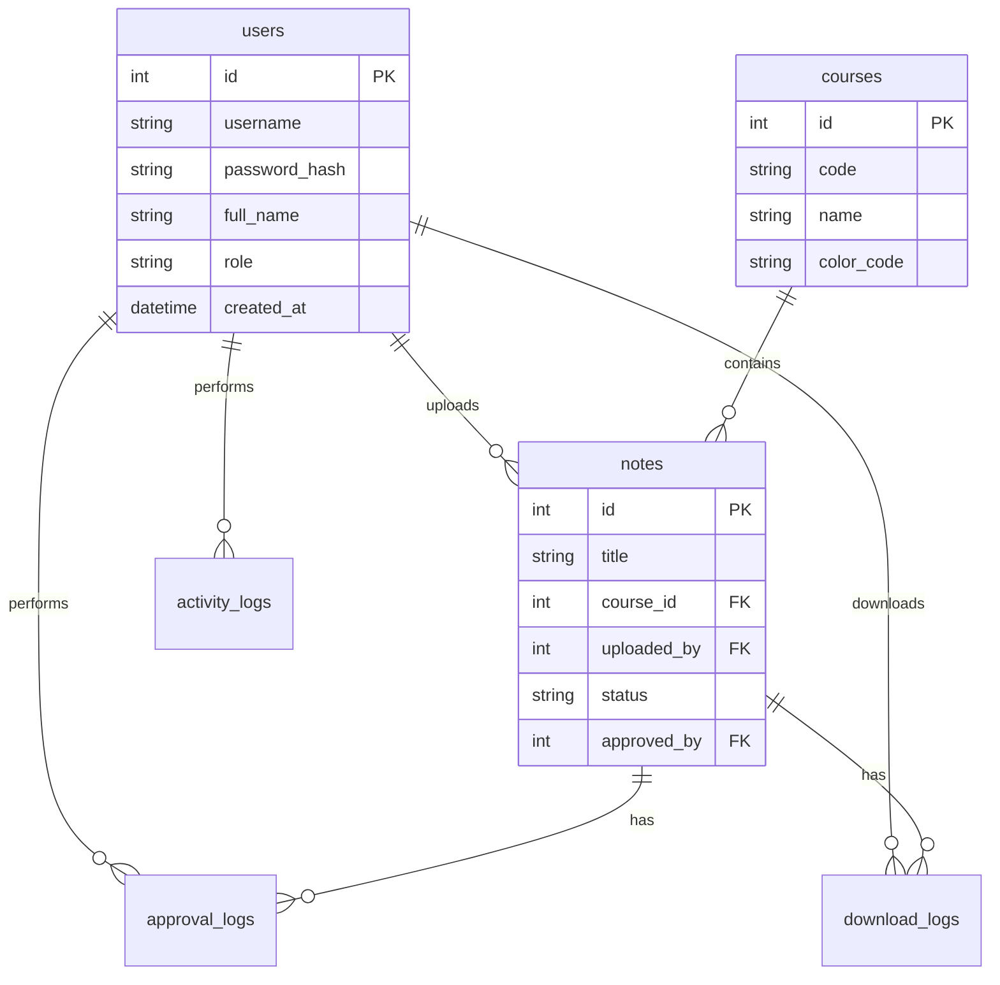

# Database Schema & User Roles Design

## Complete Database Schema

### 1. Users Table
```sql
CREATE TABLE users (
    id INT PRIMARY KEY AUTO_INCREMENT,
    username VARCHAR(50) UNIQUE NOT NULL,
    password_hash VARCHAR(255) NOT NULL,
    full_name VARCHAR(100) NOT NULL,
    email VARCHAR(100),
    role ENUM('owner', 'admin', 'student') NOT NULL DEFAULT 'student',
    roll_number VARCHAR(20), -- For students
    semester INT DEFAULT 4, -- All users are 4th semester
    created_at TIMESTAMP DEFAULT CURRENT_TIMESTAMP,
    last_login TIMESTAMP NULL,
    is_active BOOLEAN DEFAULT TRUE,
    profile_picture VARCHAR(255) DEFAULT 'default-avatar.png',
    notes_uploaded INT DEFAULT 0,
    notes_approved INT DEFAULT 0,
    CONSTRAINT chk_semester CHECK (semester BETWEEN 1 AND 8)
);

-- Sample Data
INSERT INTO users (username, password_hash, full_name, email, role, roll_number) VALUES
('raheem', '$2y$10$...', 'Raheem Ahmed', 'raheem@notesbyraheem.xyz', 'owner', NULL),
('admin1', '$2y$10$...', 'Admin One', 'admin1@notesbyraheem.xyz', 'admin', NULL),
('student01', '$2y$10$...', 'Ali Khan', 'ali.khan@example.com', 'student', 'CS-2023-001'),
('student02', '$2y$10$...', 'Sara Ahmed', 'sara.ahmed@example.com', 'student', 'CS-2023-002');
```

### 2. Courses Table
```sql
CREATE TABLE courses (
    id INT PRIMARY KEY AUTO_INCREMENT,
    code VARCHAR(20) UNIQUE NOT NULL,
    name VARCHAR(100) NOT NULL,
    description TEXT,
    semester INT NOT NULL DEFAULT 4,
    color_code VARCHAR(7) DEFAULT '#4361ee',
    icon_class VARCHAR(50) DEFAULT 'fas fa-book',
    is_active BOOLEAN DEFAULT TRUE,
    created_at TIMESTAMP DEFAULT CURRENT_TIMESTAMP,
    notes_count INT DEFAULT 0
);

-- 4th Semester Courses
INSERT INTO courses (code, name, description, color_code, icon_class) VALUES
('MATH-401', 'Multi-variable Calculus', 'Advanced calculus topics including partial derivatives, multiple integrals, vector calculus', '#4361ee', 'fas fa-calculator'),
('CS-402', 'Software Engineering', 'Software development methodologies, requirements analysis, design patterns', '#7209b7', 'fas fa-laptop-code'),
('CS-403', 'Computer Networks', 'Network architectures, protocols, TCP/IP, routing, switching, network security', '#f72585', 'fas fa-network-wired'),
('HUM-404', 'Civics and Community Engagement', 'Civic responsibilities, community development, social issues', '#4cc9f0', 'fas fa-hands-helping'),
('CS-405', 'Visual Programming', 'GUI development, event-driven programming, visual design tools', '#f8961e', 'fas fa-palette'),
('CS-406', 'Computer Organization and Assembly Language', 'Computer architecture, CPU design, memory hierarchy', '#f94144', 'fas fa-microchip');
```

### 3. Notes Table
```sql
CREATE TABLE notes (
    id INT PRIMARY KEY AUTO_INCREMENT,
    title VARCHAR(200) NOT NULL,
    description TEXT,
    course_id INT NOT NULL,
    file_name VARCHAR(255) NOT NULL,
    file_path VARCHAR(500) NOT NULL,
    file_type VARCHAR(10) NOT NULL,
    file_size INT, -- in bytes
    uploaded_by INT NOT NULL,
    upload_date TIMESTAMP DEFAULT CURRENT_TIMESTAMP,
    status ENUM('pending', 'approved', 'rejected') DEFAULT 'pending',
    approved_by INT NULL,
    approval_date TIMESTAMP NULL,
    rejection_reason TEXT,
    download_count INT DEFAULT 0,
    share_count INT DEFAULT 0,
    view_count INT DEFAULT 0,
    version INT DEFAULT 1,
    is_featured BOOLEAN DEFAULT FALSE,
    FOREIGN KEY (course_id) REFERENCES courses(id) ON DELETE CASCADE,
    FOREIGN KEY (uploaded_by) REFERENCES users(id) ON DELETE CASCADE,
    FOREIGN KEY (approved_by) REFERENCES users(id) ON DELETE SET NULL
);

-- Indexes for performance
CREATE INDEX idx_notes_status ON notes(status);
CREATE INDEX idx_notes_course ON notes(course_id);
CREATE INDEX idx_notes_uploader ON notes(uploaded_by);
```

### 4. Approvals Log Table
```sql
CREATE TABLE approval_logs (
    id INT PRIMARY KEY AUTO_INCREMENT,
    note_id INT NOT NULL,
    action ENUM('approve', 'reject', 'pending') NOT NULL,
    performed_by INT NOT NULL,
    performed_at TIMESTAMP DEFAULT CURRENT_TIMESTAMP,
    reason TEXT,
    previous_status ENUM('pending', 'approved', 'rejected'),
    FOREIGN KEY (note_id) REFERENCES notes(id) ON DELETE CASCADE,
    FOREIGN KEY (performed_by) REFERENCES users(id) ON DELETE CASCADE
);
```

### 5. Downloads Log Table
```sql
CREATE TABLE download_logs (
    id INT PRIMARY KEY AUTO_INCREMENT,
    note_id INT NOT NULL,
    user_id INT NOT NULL,
    downloaded_at TIMESTAMP DEFAULT CURRENT_TIMESTAMP,
    ip_address VARCHAR(45),
    user_agent TEXT,
    FOREIGN KEY (note_id) REFERENCES notes(id) ON DELETE CASCADE,
    FOREIGN KEY (user_id) REFERENCES users(id) ON DELETE CASCADE
);
```

### 6. Activity Log Table
```sql
CREATE TABLE activity_logs (
    id INT PRIMARY KEY AUTO_INCREMENT,
    user_id INT NOT NULL,
    action_type VARCHAR(50) NOT NULL,
    action_details TEXT,
    ip_address VARCHAR(45),
    user_agent TEXT,
    created_at TIMESTAMP DEFAULT CURRENT_TIMESTAMP,
    FOREIGN KEY (user_id) REFERENCES users(id) ON DELETE CASCADE
);

-- Action types: login, logout, upload_note, download_note, approve_note, reject_note, update_profile, etc.
```

### 7. System Settings Table
```sql
CREATE TABLE system_settings (
    id INT PRIMARY KEY AUTO_INCREMENT,
    setting_key VARCHAR(100) UNIQUE NOT NULL,
    setting_value TEXT,
    setting_type ENUM('string', 'integer', 'boolean', 'json') DEFAULT 'string',
    category VARCHAR(50),
    description TEXT,
    updated_at TIMESTAMP DEFAULT CURRENT_TIMESTAMP ON UPDATE CURRENT_TIMESTAMP,
    updated_by INT,
    FOREIGN KEY (updated_by) REFERENCES users(id) ON DELETE SET NULL
);

-- Default settings
INSERT INTO system_settings (setting_key, setting_value, setting_type, category, description) VALUES
('site_name', 'NotesByRaheem.xyz', 'string', 'general', 'Website name'),
('max_file_size', '10485760', 'integer', 'uploads', 'Maximum file size in bytes (10MB)'),
('allowed_file_types', 'pdf,docx,pptx,txt,jpg,jpeg,png', 'string', 'uploads', 'Comma-separated allowed file extensions'),
('require_approval', 'true', 'boolean', 'moderation', 'Whether notes require admin approval'),
('auto_logout_minutes', '1440', 'integer', 'security', 'Auto logout after inactivity (minutes)'),
('maintenance_mode', 'false', 'boolean', 'general', 'Maintenance mode status');
```

## User Roles & Permissions Matrix

### Owner (Raheem)
| Permission | Access Level | Description |
|------------|--------------|-------------|
| User Management | Full | Create, edit, delete all users |
| Note Management | Full | View, edit, delete any note |
| Approval System | Full | Approve/reject notes, override admin decisions |
| System Settings | Full | Configure all platform settings |
| Course Management | Full | Add, edit, delete courses |
| Analytics | Full | Access to all statistics and reports |
| Activity Logs | Full | View all user activities |
| Backup/Restore | Full | System backup and restore operations |

### Admin
| Permission | Access Level | Description |
|------------|--------------|-------------|
| User Management | View Only | View student profiles only |
| Note Management | Moderate | Approve/reject pending notes |
| Approval System | Limited | Can only approve/reject, cannot override owner |
| System Settings | None | Cannot modify system settings |
| Course Management | None | Cannot modify courses |
| Analytics | Limited | Basic statistics only |
| Activity Logs | Limited | View activities related to moderation |
| Backup/Restore | None | No access to system operations |

### Student
| Permission | Access Level | Description |
|------------|--------------|-------------|
| User Management | Self Only | Edit own profile only |
| Note Management | Own Notes | Upload notes, view own uploads |
| Approval System | None | Cannot approve/reject notes |
| System Settings | None | No access to settings |
| Course Management | None | Cannot modify courses |
| Analytics | Personal | Only personal statistics |
| Activity Logs | Personal | Only own activity history |
| Backup/Restore | None | No access to system operations |

## Authentication Flow Details

### Login Credentials Distribution
1. **Owner creates all accounts manually**
2. **Credentials format**:
   - Username: `student01`, `student02`, etc.
   - Password: Randomly generated 8-character alphanumeric
   - Sent via secure channel (email, WhatsApp, in-person)

### Password Policy
- Minimum 8 characters
- Must include letters and numbers
- No password reset by users (only owner can reset)
- Passwords stored as bcrypt hashes

### Session Management
- Session timeout: 24 hours
- Single session per user
- Automatic logout on browser close
- Session tokens stored in HTTP-only cookies

## Sample Data for Development

### Users (50 students, 3 admins, 1 owner)
```sql
-- Generate sample students
INSERT INTO users (username, password_hash, full_name, role, roll_number) VALUES
('student01', '$2y$10$...', 'Ali Khan', 'student', 'CS-2023-001'),
('student02', '$2y$10$...', 'Sara Ahmed', 'student', 'CS-2023-002'),
-- ... 48 more students ...
('admin1', '$2y$10$...', 'Admin One', 'admin', NULL),
('admin2', '$2y$10$...', 'Admin Two', 'admin', NULL),
('admin3', '$2y$10$...', 'Admin Three', 'admin', NULL),
('raheem', '$2y$10$...', 'Raheem Ahmed', 'owner', NULL);
```

### Notes (200+ sample notes)
```sql
-- Sample notes with different statuses
INSERT INTO notes (title, description, course_id, file_name, file_path, uploaded_by, status, approved_by) VALUES
('Calculus Chapter 1 Notes', 'Introduction to multivariable functions', 1, 'calc_ch1.pdf', '/uploads/approved/calc_ch1.pdf', 3, 'approved', 2),
('Software Requirements Specification', 'SRS template and examples', 2, 'srs_template.docx', '/uploads/approved/srs_template.docx', 4, 'approved', 2),
('Network Protocols Guide', 'TCP/IP protocol suite explained', 3, 'protocols_guide.pdf', '/uploads/pending/protocols_guide.pdf', 5, 'pending', NULL),
('Community Engagement Project', 'Local community project ideas', 4, 'community_project.pptx', '/uploads/rejected/community_project.pptx', 6, 'rejected', 2);
```

## Database Relationships Diagram



## Security Considerations

1. **SQL Injection Prevention**: Use prepared statements
2. **XSS Protection**: Sanitize all user inputs
3. **File Upload Security**:
   - Validate file types
   - Scan for malware
   - Store outside web root
   - Rename uploaded files
4. **Password Security**:
   - bcrypt hashing
   - Salt rounds: 12
5. **Session Security**:
   - HTTPS required
   - Secure cookies
   - CSRF tokens
6. **Access Control**:
   - Role-based middleware
   - Permission checks on all endpoints

## Backup Strategy
- Daily automated backups
- 30-day retention
- Encrypted backup files
- Off-site storage option