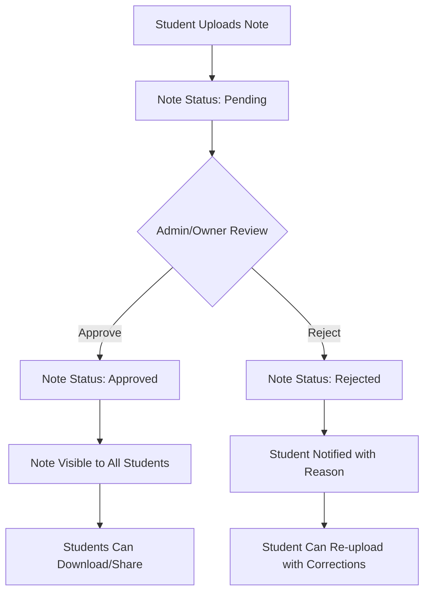

# Enhanced NotesByRaheem.xyz - Architecture Plan

## Overview
A multi-page dynamic website with authentication system, separate user roles (Owner, Admin, Student), and note approval workflow.

## User Roles & Permissions

### 1. Owner (Raheem)
- **Full system access**
- Manage all users (create/delete accounts)
- View comprehensive statistics
- Approve/Reject notes (can override admin decisions)
- Manage courses and system settings
- Access to all admin and student features

### 2. Admin (Multiple admins can be assigned)
- **Moderation privileges**
- Approve/Reject student-uploaded notes
- Manage reported content
- View user activity logs
- Cannot modify user accounts or system settings

### 3. Student (Classmates)
- **Basic user privileges**
- Browse approved notes
- Upload notes (requires admin approval)
- Download notes
- Share notes/website
- View personal upload history

## Database Schema

### Users Table
```
id: INT (PK)
username: VARCHAR(50) UNIQUE
password_hash: VARCHAR(255)
full_name: VARCHAR(100)
email: VARCHAR(100)
role: ENUM('owner', 'admin', 'student')
created_at: TIMESTAMP
last_login: TIMESTAMP
is_active: BOOLEAN
```

### Notes Table
```
id: INT (PK)
title: VARCHAR(200)
description: TEXT
course_id: INT (FK to courses)
file_path: VARCHAR(500)
file_type: VARCHAR(10)
uploaded_by: INT (FK to users)
upload_date: TIMESTAMP
status: ENUM('pending', 'approved', 'rejected')
approved_by: INT (FK to users, NULL if pending/rejected)
approval_date: TIMESTAMP
download_count: INT DEFAULT 0
share_count: INT DEFAULT 0
rejection_reason: TEXT (if rejected)
```

### Courses Table
```
id: INT (PK)
name: VARCHAR(100)
code: VARCHAR(20)
description: TEXT
semester: INT
color_code: VARCHAR(7)
is_active: BOOLEAN
```

### Activity Log Table
```
id: INT (PK)
user_id: INT (FK to users)
action: VARCHAR(50)
details: TEXT
ip_address: VARCHAR(45)
timestamp: TIMESTAMP
```

## Page Structure

### 1. Public Pages (No login required)
- **Homepage** (`index.html`) - Landing page with overview
- **Login Page** (`login.html`) - Unified login for all roles
- **About Page** (`about.html`) - Information about the platform
- **Contact Page** (`contact.html`) - Contact information

### 2. Student Pages (After login)
- **Dashboard** (`student/dashboard.html`) - Personal stats and quick actions
- **Browse Notes** (`student/browse.html`) - View approved notes by course
- **Upload Notes** (`student/upload.html`) - Submit new notes for approval
- **My Uploads** (`student/my-uploads.html`) - Track upload status
- **Profile** (`student/profile.html`) - Account settings

### 3. Admin Pages
- **Admin Dashboard** (`admin/dashboard.html`) - Moderation queue and stats
- **Pending Approvals** (`admin/approvals.html`) - Review student uploads
- **User Management** (`admin/users.html`) - View student list
- **Reports** (`admin/reports.html`) - System analytics

### 4. Owner Pages
- **Owner Dashboard** (`owner/dashboard.html`) - Complete system overview
- **User Management** (`owner/users.html`) - Create/edit all users
- **System Settings** (`owner/settings.html`) - Configure platform
- **Advanced Analytics** (`owner/analytics.html`) - Detailed statistics
- **Course Management** (`owner/courses.html`) - Add/edit courses

## Authentication Flow

### Login Process
1. User visits `/login.html`
2. Enters username/password (pre-assigned by owner)
3. System validates credentials against database
4. Redirects based on role:
   - Student → `/student/dashboard.html`
   - Admin → `/admin/dashboard.html`
   - Owner → `/owner/dashboard.html`

### Session Management
- JWT tokens or session cookies
- Automatic logout after 24 hours
- Password reset handled by owner only

## Note Approval Workflow



## File Structure
```
/notesbyraheem/
├── index.html
├── login.html
├── about.html
├── contact.html
├── css/
│   ├── main.css
│   ├── auth.css
│   └── admin.css
├── js/
│   ├── auth.js
│   ├── student.js
│   ├── admin.js
│   └── owner.js
├── student/
│   ├── dashboard.html
│   ├── browse.html
│   ├── upload.html
│   ├── my-uploads.html
│   └── profile.html
├── admin/
│   ├── dashboard.html
│   ├── approvals.html
│   ├── users.html
│   └── reports.html
├── owner/
│   ├── dashboard.html
│   ├── users.html
│   ├── settings.html
│   ├── analytics.html
│   └── courses.html
├── api/ (for backend)
│   ├── auth.php
│   ├── notes.php
│   ├── users.php
│   └── admin.php
└── uploads/ (file storage)
    ├── pending/
    └── approved/
```

## Technology Stack

### Frontend
- HTML5, CSS3, JavaScript (ES6+)
- Bootstrap 5 for responsive design
- Font Awesome for icons
- Chart.js for statistics visualization

### Backend (Simulated for now, can be implemented later)
- PHP/Node.js for authentication
- MySQL/PostgreSQL database
- File upload handling
- Session management

### Security Considerations
- Password hashing (bcrypt)
- SQL injection prevention
- XSS protection
- File upload validation
- Role-based access control

## Implementation Phases

### Phase 1: Basic Structure & Authentication
1. Create multi-page structure
2. Implement login system (simulated)
3. Create role-based navigation
4. Design responsive layouts

### Phase 2: Student Features
1. Note browsing with filters
2. Note upload interface
3. Personal dashboard
4. Profile management

### Phase 3: Admin Features
1. Approval interface
2. User viewing
3. Basic reports
4. Moderation tools

### Phase 4: Owner Features
1. User management
2. System configuration
3. Advanced analytics
4. Course management

### Phase 5: Polish & Deployment
1. Testing all workflows
2. Performance optimization
3. Security hardening
4. Deployment preparation

## Design Enhancements
- Modern gradient-based color scheme
- Interactive animations
- Dark/light mode toggle
- Advanced filtering and search
- Real-time notifications
- Progress indicators
- Loading states
- Error handling UI

## Mock Data for Development
- 50 student accounts
- 3 admin accounts
- 1 owner account
- 200+ sample notes across 6 courses
- Various approval statuses for testing

## Next Steps
1. Create detailed wireframes for each page
2. Design database tables with sample data
3. Implement authentication simulation
4. Build student interface first
5. Add admin/owner panels incrementally