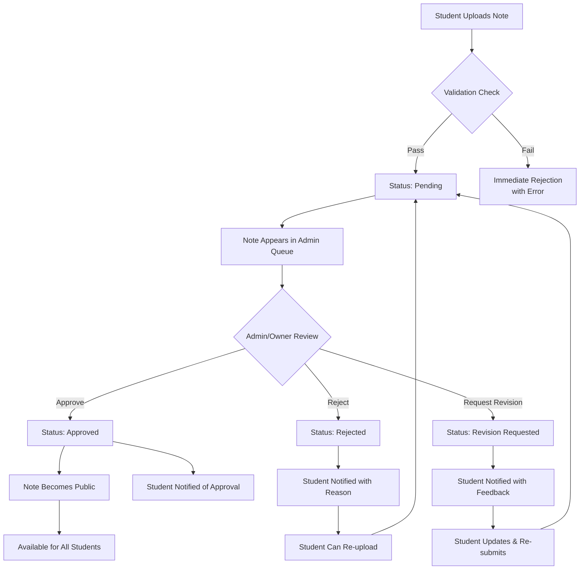

# Note Approval Workflow Design

## Overview
A comprehensive workflow for managing note submissions from upload to publication, including review, approval/rejection, and student notifications.

## Complete Workflow Diagram



## Detailed Workflow Steps

### Step 1: Student Upload
**Action**: Student submits note through upload form

**Validation Checks**:
1. **File Validation**
   - File size ≤ 10MB
   - File type allowed (PDF, DOCX, PPTX, TXT, JPG, PNG)
   - File not corrupted (basic integrity check)
   - No viruses/malware (simulated check)

2. **Content Validation**
   - Title not empty (3-200 characters)
   - Description provided (optional but recommended)
   - Course selected from list
   - No prohibited content in title/description

3. **User Validation**
   - Student account is active
   - Not exceeding upload limits (if any)
   - No spam detection triggers

**Outcomes**:
- **Success**: Note saved with status "pending", student sees confirmation
- **Failure**: Specific error shown, note not saved

### Step 2: Pending State
**Duration**: Until reviewed by admin/owner

**Note Visibility**:
- **Student**: Visible in "My Uploads" with "Pending" badge
- **Admin/Owner**: Visible in approval queue
- **Other Students**: Not visible

**Automatic Actions**:
1. **Queue Position**: Notes sorted by upload date (oldest first)
2. **Reminder System**: After 48 hours, highlight in admin dashboard
3. **Student Notification**: Upload confirmation email (optional)

### Step 3: Admin/Owner Review
**Review Interface Components**:

1. **Note Preview Panel**
   - Embedded document viewer
   - Thumbnail gallery for images
   - Text extraction for searchability
   - Download original file option

2. **Metadata Display**
   ```
   Title: Calculus Chapter 3 Notes
   Course: Multi-variable Calculus (MATH-401)
   Uploader: Ali Khan (student01)
   Uploaded: 2023-10-15 14:30
   File: calc_ch3.pdf (2.4 MB)
   Description: Partial derivatives and chain rule...
   ```

3. **Review Tools**
   - Quality rating (1-5 stars)
   - Content categorization tags
   - Duplicate detection check
   - Similar notes comparison

### Step 4: Decision Points

#### Option A: Approve
**Requirements**:
- Content is relevant to course
- File is readable and complete
- No copyright violations
- Appropriate quality level

**Approval Actions**:
1. Change status to "approved"
2. Set approval timestamp
3. Record approving admin/owner
4. Increment student's approved notes count
5. Make note publicly visible
6. Trigger notification to student

**Additional Options**:
- **Feature Note**: Mark as featured (appears on homepage)
- **Add Review Notes**: Private comments for other admins
- **Assign Quality Score**: 1-5 for sorting/filtering

#### Option B: Reject
**Rejection Reasons** (predefined + custom):
1. **Poor Quality**
   - Blurry/scanned images
   - Incomplete content
   - Illegible handwriting
   - Poor organization

2. **Incorrect Content**
   - Wrong course/category
   - Off-topic material
   - Personal notes not useful to others

3. **Duplicate Content**
   - Already exists in system
   - Minor variations only
   - Repost of same material

4. **Policy Violation**
   - Copyright infringement
   - Inappropriate content
   - Spam/advertising
   - Personal information exposure

5. **Technical Issues**
   - Corrupted file
   - Unreadable format
   - Password protected
   - Too large/small

**Rejection Actions**:
1. Change status to "rejected"
2. Record rejection reason (required)
3. Add detailed comments (optional)
4. Set rejection timestamp
5. Trigger notification to student with reason
6. Option to allow re-upload with corrections

#### Option C: Request Revision
**When Used**:
- Content has potential but needs improvement
- Minor issues that student can fix
- Formatting problems
- Missing information

**Revision Request Actions**:
1. Change status to "revision_requested"
2. Provide specific feedback for improvement
3. Set deadline for resubmission (e.g., 7 days)
4. Trigger notification to student with instructions
5. Note remains in pending queue with revision flag

### Step 5: Post-Decision Actions

#### For Approved Notes:
1. **Public Visibility**
   - Appears in course browse pages
   - Included in search results
   - Counted in course statistics
   - Eligible for featuring

2. **Student Rewards** (optional)
   - Badge on profile for quality uploads
   - Recognition in leaderboards
   - Priority in future approvals

3. **System Updates**
   - Course note count incremented
   - Storage moved from pending to approved
   - Search index updated
   - Cache cleared for related pages

#### For Rejected Notes:
1. **Student Options**
   - View rejection reason
   - Appeal decision (contacts admin)
   - Delete the upload
   - Re-upload corrected version

2. **Data Retention**
   - File kept for 30 days (configurable)
   - Metadata retained for analytics
   - Option to purge immediately

3. **Learning Opportunity**
   - Provide upload guidelines link
   - Suggest similar approved notes as examples
   - Offer help/guidance for future uploads

#### For Revision Requests:
1. **Student Actions**
   - View feedback and requirements
   - Download original file for editing
   - Re-upload revised version
   - Add revision notes explaining changes

2. **System Handling**
   - Link new version to original
   - Maintain revision history
   - Reset review timer
   - Priority in queue (revision flag)

## Notification System

### Student Notifications
**Types**:
1. **Upload Confirmation**
   - Immediate after successful upload
   - Contains upload details and expected review time

2. **Approval Notification**
   - When note is approved
   - Link to approved note
   - Congratulations message

3. **Rejection Notification**
   - When note is rejected
   - Clear explanation of reason
   - Suggestions for improvement
   - Link to re-upload if allowed

4. **Revision Request**
   - Specific feedback for improvement
   - Deadline for resubmission
   - Instructions for next steps

5. **Reminder Notifications**
   - After 7 days if no action on revision request
   - Weekly digest of upload status

**Delivery Methods**:
- In-app notifications (bell icon)
- Email notifications (configurable)
- Dashboard alerts
- Mobile push (future enhancement)

### Admin/Owner Notifications
**Types**:
1. **New Upload Alert**
   - When note enters pending queue
   - Summary of upload details
   - Link to approval interface

2. **Queue Status**
   - Daily summary of pending count
   - Highlight of oldest pending items
   - Weekly statistics report

3. **System Alerts**
   - Unusual upload patterns
   - Potential spam detection
   - System errors in approval process

## Quality Control Mechanisms

### Automated Checks
1. **Plagiarism Detection** (simulated)
   - Compare with existing notes
   - Check for copied content from web
   - Flag potential duplicates

2. **Content Quality Scoring**
   - File size appropriateness
   - Document structure analysis
   - Image quality assessment
   - Text readability score

3. **Metadata Validation**
   - Course relevance scoring
   - Title-description consistency
   - Appropriate tagging

### Manual Review Guidelines
**Quality Rubric** (for admin training):
```
Excellent (5/5):
- Well-organized with clear structure
- Complete coverage of topic
- High readability (typed, good formatting)
- Includes examples/exercises
- Original content or properly attributed

Good (4/5):
- Generally well-organized
- Covers main topics adequately
- Readable with minor formatting issues
- Some examples included
- Mostly original content

Average (3/5):
- Basic organization
- Covers key points but incomplete
- Readable but could be improved
- Few or no examples
- May contain unattributed content

Poor (2/5):
- Poor organization
- Incomplete coverage
- Difficult to read (handwriting, poor scan)
- No examples
- Significant unattributed content

Unacceptable (1/5):
- No organization
- Minimal relevant content
- Illegible
- Copyright violations
- Inappropriate content
```

### Escalation Procedures
1. **Borderline Cases**
   - Flag for second opinion
   - Discuss in admin team
   - Escalate to owner if needed

2. **Dispute Resolution**
   - Student appeals rejection
   - Admin re-review with fresh eyes
   - Owner makes final decision

3. **Policy Questions**
   - Uncertain about copyright
   - Borderline content appropriateness
   - New type of content not covered by guidelines

## Performance Metrics & Analytics

### Approval Process Metrics
1. **Time Metrics**
   - Average approval time: 24 hours target
   - 95th percentile approval time: 72 hours
   - Queue processing rate: notes/hour

2. **Quality Metrics**
   - Approval rate: target 70-80%
   - Rejection rate by reason
   - Revision request rate
   - Student satisfaction with process

3. **Efficiency Metrics**
   - Notes reviewed per admin hour
   - Decision consistency between admins
   - Error rate (wrong decisions)

### Student Experience Metrics
1. **Upload Experience**
   - Upload success rate
   - Form abandonment rate
   - Common validation errors

2. **Satisfaction Metrics**
   - Student feedback on process
   - Willingness to upload again
   - Perception of fairness

3. **Learning Metrics**
   - Improvement in upload quality over time
   - Reduction in rejection rates for repeat uploaders
   - Adoption of best practices

## Admin Training & Guidelines

### Review Best Practices
1. **Consistency First**
   - Apply same standards to all students
   - Use predefined rejection reasons consistently
   - Document edge case decisions for reference

2. **Constructive Feedback**
   - Focus on improvement, not just rejection
   - Provide specific, actionable suggestions
   - Be respectful and professional

3. **Efficiency Tips**
   - Batch process similar notes
   - Use keyboard shortcuts
   - Set daily review goals
   - Take breaks to maintain focus

### Decision Support Tools
1. **Reference Materials**
   - Course syllabi and learning objectives
   - Sample excellent notes for each course
   - Copyright guidelines
   - Quality rubric cheat sheet

2. **Collaboration Features**
   - Internal comments between admins
   - Note sharing for second opinions
   - Decision history for similar cases

3. **Automation Aids**
   - Auto-suggest rejection reasons based on content
   - Duplicate detection alerts
   - Quality score predictions

## Continuous Improvement

### Feedback Loop
1. **Student Feedback Collection**
   - Post-approval satisfaction survey
   - Suggestion box for process improvement
   - Regular user interviews

2. **Admin Feedback**
   - Weekly review process meetings
   - Suggestion system for tool improvements
   - Training needs assessment

3. **Process Analytics**
   - Regular review of metrics
   - Identification of bottlenecks
   - A/B testing of process changes

### Process Refinement
1. **Quarterly Reviews**
   - Analyze approval/rejection patterns
   - Update guidelines based on trends
   - Train admins on updated procedures

2. **Tool Improvements**
   - Enhance review interface based on feedback
   - Add new automation features
   - Improve notification system

3. **Policy Updates**
   - Adjust file size limits if needed
   - Update allowed file types
   - Refine quality standards

## Emergency Procedures

### System Outages
1. **During Review Process**
   - Save progress frequently
   - Offline decision tracking
   - Batch update when system returns

2. **During Student Upload**
   - Clear error message
   - Save draft locally if possible
   - Provide alternative submission method

### Content Controversies
1. **Disputed Decisions**
   - Temporary hold on note
   - Review by owner
   - Transparent communication with student

2. **Legal Issues**
   - Immediate removal if copyright claim
   - Preservation of evidence
   - Legal consultation if needed

### High Volume Periods
1. **Exam Season Surge**
   - Temporary additional admins
   - Extended review hours
   - Clear communication about delays

2. **Backlog Management**
   - Priority system (oldest first)
   - Bulk approval for low-risk notes
   - Temporary quality standard adjustment

This comprehensive approval workflow ensures quality control while providing a positive experience for students and efficient tools for admins and owners.