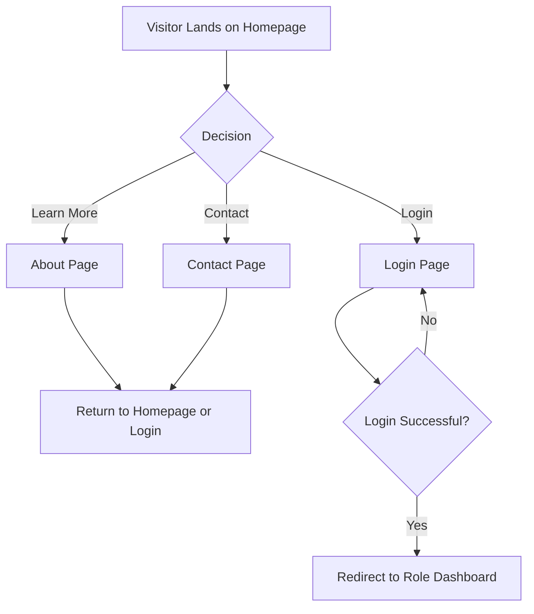
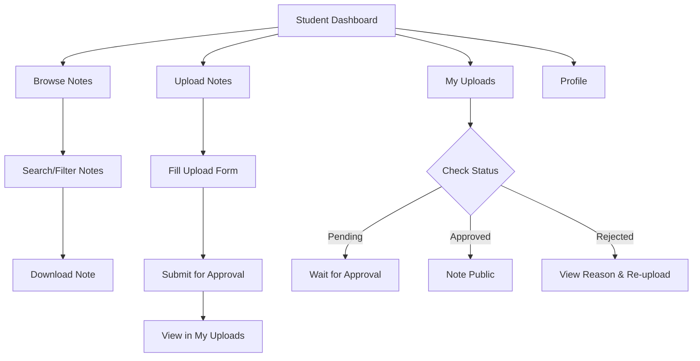
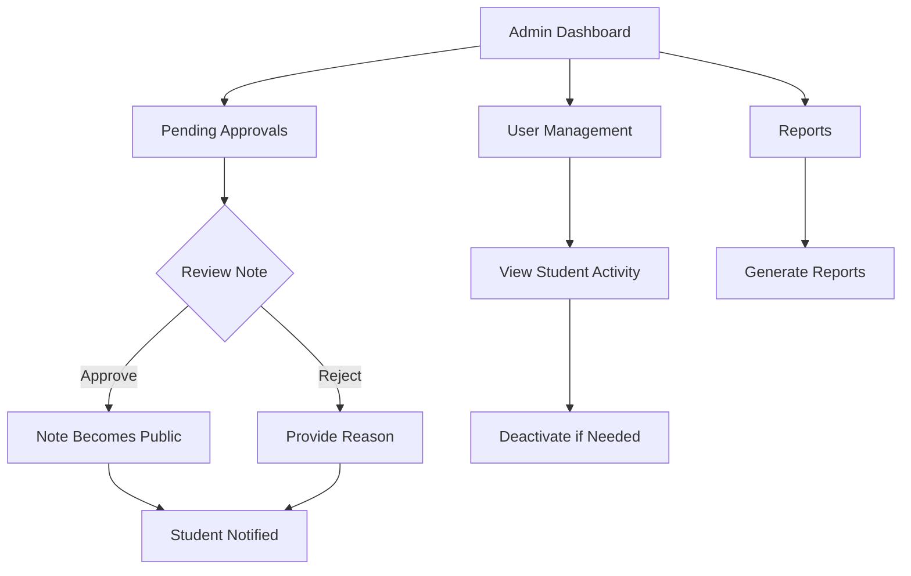
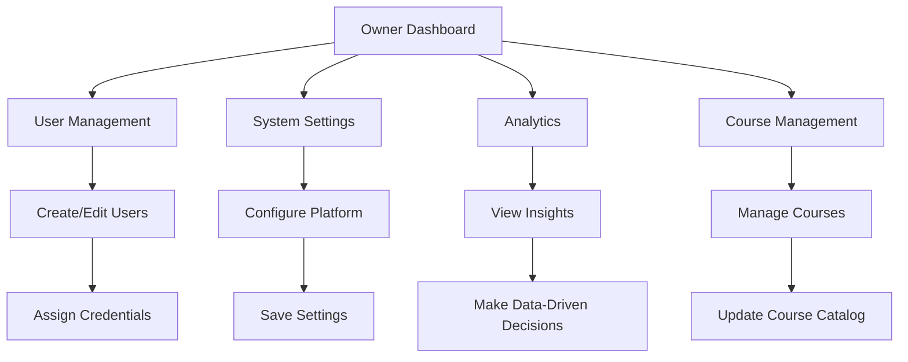

# Page Structure & Navigation Flow

## Complete Page Hierarchy

```
/ (root)
├── index.html                    # Public homepage
├── login.html                    # Unified login page
├── about.html                    # About the platform
├── contact.html                  # Contact information
├── css/                          # Stylesheets
│   ├── main.css                  # Global styles
│   ├── auth.css                  # Authentication styles
│   ├── student.css               # Student panel styles
│   ├── admin.css                 # Admin panel styles
│   └── owner.css                 # Owner panel styles
├── js/                           # JavaScript files
│   ├── auth.js                   # Authentication logic
│   ├── student.js                # Student functionality
│   ├── admin.js                  # Admin functionality
│   ├── owner.js                  # Owner functionality
│   └── common.js                 # Shared utilities
├── assets/                       # Images, icons, fonts
│   ├── images/
│   ├── icons/
│   └── fonts/
├── student/                      # Student pages
│   ├── dashboard.html            # Student dashboard
│   ├── browse.html               # Browse approved notes
│   ├── upload.html               # Upload new notes
│   ├── my-uploads.html           # View upload history
│   └── profile.html              # Profile settings
├── admin/                        # Admin pages
│   ├── dashboard.html            # Admin dashboard
│   ├── approvals.html            # Pending note approvals
│   ├── users.html                # View student list
│   ├── reports.html              # Basic reports
│   └── activity.html             # Activity logs
├── owner/                        # Owner pages
│   ├── dashboard.html            # Owner dashboard
│   ├── users.html                # Manage all users
│   ├── settings.html             # System settings
│   ├── analytics.html            # Advanced analytics
│   ├── courses.html              # Course management
│   └── backups.html              # Backup management
└── api/                          # Backend API endpoints
    ├── auth.php                  # Authentication
    ├── notes.php                 # Note operations
    ├── users.php                 # User management
    └── admin.php                 # Admin operations
```

## Page Descriptions & Functionality

### 1. Public Pages

#### index.html (Homepage)
- **Purpose**: Landing page for all visitors
- **Content**:
  - Hero section with platform overview
  - Featured notes/courses
  - Statistics counter
  - Call-to-action buttons (Login, Learn More)
  - Testimonials from students
  - Footer with quick links
- **Navigation**: Login, About, Contact

#### login.html (Unified Login)
- **Purpose**: Single login page for all user roles
- **Content**:
  - Brand logo and tagline
  - Login form (username/password)
  - Role selection (auto-detected from credentials)
  - "Forgot password" (contacts owner)
  - Login status messages
- **Functionality**:
  - Validates credentials against simulated database
  - Redirects to appropriate dashboard based on role
  - Sets session cookie/token
  - Shows error messages for invalid login

#### about.html (About Page)
- **Purpose**: Information about the platform
- **Content**:
  - Mission and vision
  - Features overview
  - Team information (Raheem as owner)
  - How it works guide
  - FAQ section
  - Contact information

#### contact.html (Contact Page)
- **Purpose**: Contact form and information
- **Content**:
  - Contact form (name, email, message)
  - Owner contact details
  - Response time information
  - Social media links

### 2. Student Pages

#### student/dashboard.html (Student Dashboard)
- **Purpose**: Central hub for student activities
- **Content**:
  - Welcome message with student name
  - Quick stats (notes uploaded, approved, downloaded)
  - Recent activity feed
  - Quick actions (Upload, Browse, Profile)
  - Notifications (approval status, new notes)
  - Course-wise note counts
- **Navigation**: All student pages, Logout

#### student/browse.html (Browse Notes)
- **Purpose**: Discover and download approved notes
- **Content**:
  - Search bar with filters
  - Course filter tabs
  - Grid/List view toggle
  - Note cards with: title, course, uploader, date, stats
  - Pagination or infinite scroll
  - Sort options (date, downloads, popularity)
- **Functionality**:
  - Filter by course, date range, file type
  - Search by title, description, uploader
  - Download notes (simulated)
  - Share notes via social media
  - Bookmark favorite notes

#### student/upload.html (Upload Notes)
- **Purpose**: Submit new notes for approval
- **Content**:
  - Multi-step upload form
  - Course selection with descriptions
  - File upload with drag & drop
  - Title and description fields
  - Preview of selected file
  - Upload guidelines and restrictions
  - Progress indicator
- **Functionality**:
  - File validation (size, type)
  - Form validation
  - Success/error messages
  - Upload history link

#### student/my-uploads.html (My Uploads)
- **Purpose**: Track personal upload status
- **Content**:
  - Tabbed interface (All, Pending, Approved, Rejected)
  - Upload statistics
  - List of uploaded notes with status badges
  - Approval/rejection reasons
  - Option to re-upload rejected notes
  - Download counts for approved notes
- **Functionality**:
  - Filter by status
  - View detailed status information
  - Edit pending uploads (before approval)
  - Delete own notes (if pending)

#### student/profile.html (Profile Settings)
- **Purpose**: Manage personal information
- **Content**:
  - Profile picture upload
  - Personal information (read-only: name, roll number)
  - Change password (request to owner)
  - Account statistics
  - Login history
  - Privacy settings
- **Functionality**:
  - Update profile picture
  - View account details
  - Request password reset
  - Export personal data

### 3. Admin Pages

#### admin/dashboard.html (Admin Dashboard)
- **Purpose**: Admin overview and quick actions
- **Content**:
  - Pending approval count (highlighted)
  - Recent uploads timeline
  - System statistics
  - Quick approval queue
  - Recent user activity
  - Admin notifications
- **Navigation**: All admin pages, Switch to Student View (if also student), Logout

#### admin/approvals.html (Pending Approvals)
- **Purpose**: Review and moderate student uploads
- **Content**:
  - List of pending notes with preview
  - Note details (title, course, uploader, date)
  - File preview (PDF viewer, image preview)
  - Approval/Rejection buttons
  - Rejection reason dropdown/text input
  - Bulk actions
  - Filter by course, upload date
- **Functionality**:
  - Approve notes (makes them public)
  - Reject notes with reason
  - Request revisions from student
  - View note history

#### admin/users.html (User Management)
- **Purpose**: View and monitor student accounts
- **Content**:
  - Student list with search
  - Student details (name, roll number, upload stats)
  - Activity status (last login)
  - Option to deactivate/reactivate accounts
  - Export user list
  - User activity charts
- **Functionality**:
  - Search and filter students
  - View student profiles
  - Deactivate problematic accounts
  - View student upload history

#### admin/reports.html (Reports & Analytics)
- **Purpose**: System insights and statistics
- **Content**:
  - Upload trends chart
  - Course-wise distribution
  - Top uploaders
  - Most downloaded notes
  - Approval/rejection rates
  - System usage statistics
- **Functionality**:
  - Date range filtering
  - Export reports as CSV/PDF
  - Print reports

#### admin/activity.html (Activity Logs)
- **Purpose**: Monitor system activities
- **Content**:
  - Filterable activity log table
  - User actions with timestamps
  - IP addresses (masked)
  - Search by user or action type
  - Export logs
- **Functionality**:
  - Real-time log updates
  - Filter by date, user, action type
  - View detailed action information

### 4. Owner Pages

#### owner/dashboard.html (Owner Dashboard)
- **Purpose**: Complete system overview
- **Content**:
  - System health indicators
  - Real-time statistics
  - Recent alerts and notifications
  - Quick access to all management sections
  - Server status and performance
  - Backup status
- **Navigation**: All owner pages, Switch to Admin/Student View, Logout

#### owner/users.html (User Management)
- **Purpose**: Full user account management
- **Content**:
  - Create new user form
  - User list with role filtering
  - Edit user details
  - Reset passwords
  - Assign/change roles
  - Bulk user operations
  - Import/export users
- **Functionality**:
  - Create new accounts (all roles)
  - Edit any user profile
  - Reset any password
  - Change user roles
  - Deactivate/activate accounts
  - Export user data

#### owner/settings.html (System Settings)
- **Purpose**: Configure platform settings
- **Content**:
  - General settings (site name, logo, colors)
  - Upload settings (file limits, allowed types)
  - Security settings (session timeout, login attempts)
  - Email settings (notifications)
  - Maintenance mode toggle
  - Backup settings
- **Functionality**:
  - Update all system settings
  - Test email configuration
  - Enable/disable features
  - Clear cache

#### owner/analytics.html (Advanced Analytics)
- **Purpose**: Deep insights and business intelligence
- **Content**:
  - Interactive dashboards
  - User engagement metrics
  - Growth trends
  - Performance benchmarks
  - Predictive analytics
  - Custom report builder
- **Functionality**:
  - Custom date ranges
  - Multiple chart types
  - Data export in various formats
  - Scheduled reports
  - Comparison analytics

#### owner/courses.html (Course Management)
- **Purpose**: Manage course catalog
- **Content**:
  - Add new course form
  - Course list with edit/delete
  - Course details (code, name, description, color)
  - Semester assignment
  - Course statistics
  - Bulk course operations
- **Functionality**:
  - Add new courses
  - Edit existing courses
  - Delete courses (with confirmation)
  - Reorder courses
  - Import/export course list

#### owner/backups.html (Backup Management)
- **Purpose**: System backup and restore
- **Content**:
  - Backup schedule settings
  - Manual backup trigger
  - Backup history list
  - Restore from backup
  - Download backup files
  - Storage usage
- **Functionality**:
  - Schedule automatic backups
  - Create manual backups
  - Restore system from backup
  - Download backup files
  - Monitor backup health

## Navigation Flow Diagrams

### Public Visitor Flow


### Student Navigation Flow


### Admin Workflow


### Owner Management Flow


## Responsive Design Considerations

### Breakpoints
- **Mobile**: < 768px (hamburger menu, stacked layouts)
- **Tablet**: 768px - 1024px (adjusted grids, side navigation)
- **Desktop**: > 1024px (full navigation, multi-column layouts)

### Mobile-First Approach
1. Start with mobile layouts
2. Enhance for tablet
3. Optimize for desktop
4. Test on all device sizes

## Accessibility Features
- ARIA labels for screen readers
- Keyboard navigation support
- High contrast mode
- Font size adjustment
- Skip to main content links
- Alt text for all images

## Performance Optimization
- Lazy loading for images and content
- Minified CSS and JavaScript
- Browser caching
- CDN for static assets
- Optimized image formats
- Code splitting for JavaScript

## Browser Compatibility
- Chrome (latest 2 versions)
- Firefox (latest 2 versions)
- Safari (latest 2 versions)
- Edge (latest 2 versions)
- Mobile browsers (Chrome, Safari)

## Next Steps
1. Create wireframes for each page
2. Design UI components library
3. Implement authentication simulation
4. Build student interface first
5. Add role-based navigation
6. Test complete user flows